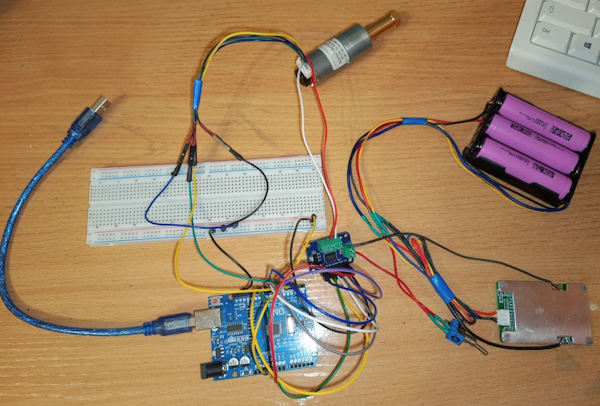

## 1. Overview

**Что это:** система управления скоростью двигателя постоянного тока с энкодером. Реализована на Arduino Uno. Включает:
- Feed-forward + PID регулятор
- Телеметрию через Serial в CSV
- Python-скрипт для сбора и визуализации
- Экспериментальную настройку на 3 уставках
- Disturbance rejection тест

**Зачем:** первый этап перехода от backend-разработки к robotics. Цель — понять управление моторами **экспериментально**, а не «по курсу».

**Стек:** C++ (Arduino), Python (телеметрия + matplotlib).

---

## 2. Architecture

**Разделение на слои:**

```
┌─────────────────────────────────────┐
│  Serial Commands (Reader + Parser)  │  ← команды от PC: MOTOR, STOP, MODE
├─────────────────────────────────────┤
│  Trajectory Generator               │  ← плавный разгон (отключён для step)
├─────────────────────────────────────┤
│  Controller (FF + PID)              │  ← управление скоростью
├─────────────────────────────────────┤
│  Estimator (RPM from encoder)       │  ← оценка скорости
├─────────────────────────────────────┤
│  Hardware (Encoder, Motor, Driver)  │  ← физический уровень
└─────────────────────────────────────┘
```

**Ключевые архитектурные решения:**
- **Non-blocking loop** — всё на `millis()`, никаких `delay()`.
- **FSM для парсера** — Idle / Reading / Discarding.
- **Разделение interval'ов** — estimator 100 мс, controller 50 мс, telemetry 20 мс.
- **Anti-windup** через проверку saturation.

---

## 3. Hardware

| Компонент | Модель | Назначение |
|---|---|---|
| MCU | Arduino Uno (ATmega328P) | Управление |
| Motor | JGA25-370B (12V, с редуктором и энкодером) | Привод |
| Driver | TB6612-V2 (dual H-bridge, 3.2A) | Управление мотором |
| Encoder | Встроенный, 495 ticks/rev | Обратная связь |

**Схема подключения:**
- Encoder A → D2 (INT0), Encoder B → D4
- Motor PWM → D5, Direction → D6, D7
- Питание мотора: 12V отдельно от MCU



---

## 4. Firmware

**Классы:**
- `Reader` — non-blocking чтение Serial с FSM.
- `Parser` — разбор команд в `Command` struct.
- `Encoder` — подсчёт тиков через ISR.
- `Motor` — управление PWM и направлением.
- `Estimator` — расчёт RPM из дельты тиков, low-pass фильтр.
- `Controller` — FF + PID.
- `TrajectoryGenerator` — плавный разгон (отключён для step response).

**Ключевые исправления в процессе:**
- `abs` → `fabsf` для float.
- `uint8_t` → `int16_t` для PWM (отрицательные значения при реверсе).
- Убран `dischargeFactor` — упростил anti-windup.
- Убран костыль с `acceleration` — некорректно считался.
- `calcD` — производная теперь от измерения к измерению, а не от вызова.

---

## 5. Control Design

**Feed-forward:**
```
uff = 2.64 × targetRpm − 1
```
Коэффициенты сняты **экспериментально**: FF подобран так, чтобы **слегка недорегулировать** (~1 RPM). Тогда `I` всегда работает «в плюс» и **не дрейфует**.

**PID:**
- `kp = 1.0` — подобран экспериментально: overshoot 21%, settle 700 мс.
- `ki = 1.0` — компенсирует нелинейность FF, даёт точность в пределах шума энкодера.
- `kd = 0` — **обоснованно отключён** (см. Limitations).

**Anti-windup:** не интегрировать, если выход в saturation и ошибка в ту же сторону.

**Deadband:** `|error| < 1.5` → не интегрировать (шум энкодера не накапливается).

---

## 6. Telemetry & Analysis

**Прошивка** шлёт CSV-строки:
```
T:<millis>,desired,traj,current,error,p,i,d,uff,pwm
```

**Python-скрипт** (`tools/telemetry_reader.py`):
- Открывает Serial на 115200.
- Ждёт 2 сек стабилизации.
- Отправляет `MODE AUTO`, `MOTOR 1 <rpm>`.
- Пишет телеметрию в CSV.
- В конце — `STOP`.

**Графики** (`tools/plot_telemetry.py`):
- Скорость: desired / traj / current.
- Компоненты: p, i, d, uff, pwm.

---

## 7. Results

### Step response на 20, 50, 80 RPM

| Уставка | Overshoot | Undershoot | Settle time | `i` в равновесии |
|---|---|---|---|---|
| **20** | +15% | −58% | ~500 мс | 3.3 |
| **50** | +21% | −3% | ~700 мс | 5.0 |
| **80** | +3% | −3% | ~300 мс | 0.5 |

**Графики:** *(вставь PNG для каждой уставки)*

**Наблюдение:** FF **идеален для 80 RPM** (`i ≈ 0`). Для 20 и 50 — слегка занижен, `i` компенсирует. Это **правильно** — линейная модель FF не идеальна для всего диапазона, I компенсирует нелинейность.

### Disturbance rejection

Мотор нагружался рукой на 3–5 секунде. Скорость падала до 36 RPM, `i` рос до 36, после снятия нагрузки — **восстановление за ~1 сек**, `i` вернулся к 4.6.

**График:** *(вставь PNG)*

---

## 8. Limitations & Lessons Learned

### Энкодер квантован — 1.21 RPM

При 50 RPM за 100 мс мотор проходит **41.25 тиков**. Энкодер считает только целые — отсюда **шаг 1.21 RPM**. Точность управления **ограничена снизу** этим значением.

### D-регулятор не работает на этой платформе

**Проверено три подхода:**

| `alpha` | `tau` фильтра | Результат |
|---|---|---|
| 0.1 | 0.9 сек | D мёртвый — не успевает за процессом |
| 0.3 | 0.23 сек | D вредный — затягивает settle, увеличивает undershoot |
| — | — | **Без D — лучший результат** |

**Причина:** производная от квантованного сигнала — ступенчатая. Чтобы её сгладить, нужен сильный фильтр. Сильный фильтр вносит фазовое запаздывание. D с запаздыванием — **тормоз, который срабатывает после события**.

**Решение:** для velocity control с шумным энкодером **D не нужен**. Для position control — понадобится точный энкодер.

### FF должен быть слегка занижен

Если FF **точен** — I дрейфует случайно из-за шума. Если FF **завышен** — ошибка всегда отрицательная, I **дрейфует вниз**. Если FF **занижен** — I работает «в плюс» и **стабилизируется**.

**Это ключевой инсайт:** FF калибруется с запасом вниз, I доводит до точности.

---

## 9. Roadmap

**Следующий этап — STM32 (NUCLEO-G474RE):**
- **Hardware encoder mode таймера** — без ISR, точный подсчёт.
- **4x quadrature** — разрешение в 4 раза выше (шаг 0.3 RPM).
- **Фиксированный Ts через таймер** — без джиттера.
- **DMA для телеметрии** — CPU свободен.
- **FreeRTOS** — реальная многозадачность.
- **CAN** — промышленная шина.

**После STM32:**
- Каскадный регулятор (position → velocity).
- Собственный differential-drive робот.
- ROS2.